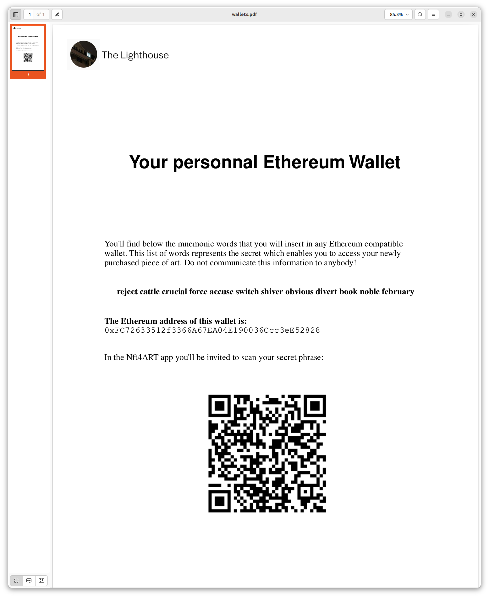

# Introduction

This project consists of three different parts:

- The server which connects to the blockchain and serves the clients
- The Point of sale (named PoS in this document) which is used by the art gallery
- The companion app which is dedicated to the token owners

This documents focuses on the PoS and go through its main capabilities

## Setup

The server to connect to the blockchain needs to maintain the private key. This private key is stored encrypted on a file located on the server
To initiate any operation with the server, the wallet must be decrypted first. To perform this, the wallet password has to be inputted by the art gallery manager

# Manager Login

The main screen is accessible at [https://www.nft2art.com/pos-client](https://www.nft2art.com/pos-client) :

When clicking on the `Admin Login`, a password is requested:

The wallet password (containing the art gallery private key) is the password to provide. For the testing site the password is `12345678`

Then the list of tokens is displayed:

# Main screen

The bottom navigation menu offers different options:
- Tokens: the current view
- Wallets: the feature to generate paper wallets
- New vote: to create a new questionnaire for a vote
- Votes: shows all the votes and their results
- PoS: lists all the point of sale connected to the server (not working in this version)
- Settings: currently to create a new smart contract (please do not use)
- Logout

# Paper Wallets

As most of the customers will not own a wallet, with this feature, we prepare paper wallets so that they can receive the tokens they have bought on a personnal wallet. Those paper wallets will need to be printed before the event.

This screen creates the requested number of paper wallets:

When the paper wallets have been generated, they are directly downloaded to the browser.
The paper wallet it self contains the private key like shown here:

On the envoloppe, which should be sealed, the address associated with the wallet is printed in plain text and as a QR code. It will be used by the saleman to scan where to transfer the bought tokens

# New Vote

The project introduces a light governance module with which the owners can take control of the art work life cycle, the new vote feature enables the manager to create a new vote, as shown below:

A vote is made of different questions which can be of different nature:

- Radio buttons (one only can be selected)
- Multiple choices
- Ranking (1 to 5)
- Slider (range is configurable)
- Date picker
- Option between different choices

When the questionnaire is built, it can be saved on the server and will get activated

# Votes

Shows all the votes that have been created, ckicking on one of them displays the results

# PoS

This screen will display and administrate the point of sale connected to the server

# Settings

For now, this enables the creation of a new smart contract which should not be done in regular operations. 

# Sales Login

This is the login which should be used by the sale team. It is not requiring any password considering that the device on which the application is running is secured by a fingerprint or a password. Note that the sale login cannot be activated if the server has not been connected once with the admin password

The sale login is accessible here:

The sales login shows the collection of tokens available.

In the case of the Puzzle of a Mazze piece of art, we only have one collection of tokens. The software supports currently different token collections which can also be presented as a map or as shown here, as no map for this collection has been created, a grid of the tokens as shown below:

If a token has already been sold, the quantity is null and it is locked has shown here:

When clicking on a token available for sale, the system asks for the currency:

Then this bring to the next screen which finalizes the sale depending on the currency selected. For a sale in CHF, the following screen is displayed:

This screenshot has been performed on a device which is not equiped with a camera. Therefore, this screen does not show the QR scanner which is displayed on another device. 

The saleman should scan the destination address which is eitther the existing wallet of the customer or a paper wallet. When this is scanned, the next screen asks for a final confirmation:

Then, the following screen 

